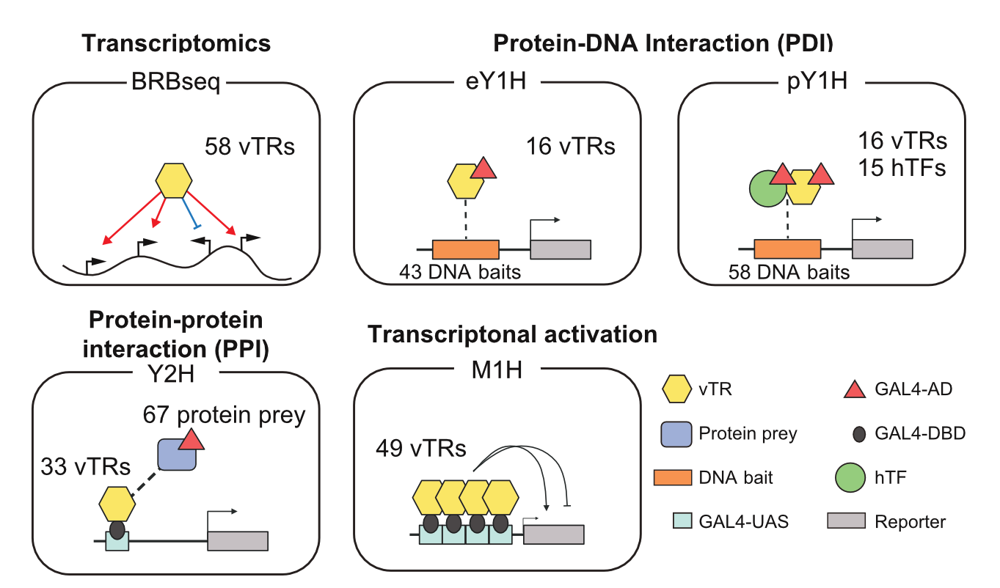

# Viral Transcriptional Regulators (vTR) Functional Characterization

This repository contains the computational pipeline and analysis scripts for the functional characterization of Viral Transcriptional Regulators (vTRs). The project integrates bulk RNA barcoding and sequencing (BRB-seq), Yeast One/Two-Hybrid assays, and structural predictions to analyze host gene expression changes, pathway enrichment, and functional similarities between viral and human transcription factors.

## Data Availability

The raw sequencing data and processed count matrices associated with this study are available at the Gene Expression Omnibus (**GSE312349**).

## Experimental Overview

The code in this repository analyzes data generated through a multimodal interrogation of vTR function. This includes transcriptomic profiling, protein-DNA interaction assays, protein-protein interaction screens, and transcriptional activation assays.

* **Figure 1: Overview of multimodal interrogation of vTR function.** (Top Left) Transcriptomics via BRB-seq performed on 58 vTRs. (Top Right) Protein-DNA Interaction (PDI) assessed via enhanced yeast one-hybrid (eY1H) and paired yeast one-hybrid (pY1H) assays. (Bottom Left) Protein-protein interaction (PPI) mapped using yeast two-hybrid (Y2H). (Bottom Right) Transcriptional activation measured via mammalian one-hybrid (M1H).
    * *Abbreviations:* Gal4-AD, Gal4 activation domain; Gal4-DBD, Gal4 DNA-binding domain; Gal4-UAS, Gal4 upstream activation sequence; vTR, viral transcriptional regulator; hTF, human transcription factor.

### Specific Approaches

* **vTR Expression:** 95 vTR ORF sequences cloned into pEZY3 constitutive expression vectors and transfected into HEK293T cells.
* **Transcriptomics (BRB-seq):** RNA harvested 2 days post-transfection (with or without Sendai Virus/SeV infection) and sequenced using the MERCURIUS DRUG-seq kit on an Illumina Novaseq (5M reads/sample).
* **Interaction Assays:** Data includes results from eY1H for cytokine promoters, pY1H for cooperativity, and Y2H for protein-protein interactions.
* **Chromatin Accessibility:** PROD-ATAC screening for chromatin accessibility profiles (see *Related Repositories*).

## Repository Structure

### 1. Pre-processing and Differential Gene Expression
**Directory:** `vTR_brb_pre_processing_analysis/`

This module handles the primary processing of BRB-seq data. It aligns raw reads to a custom reference genome and performs differential expression analysis.

* **Computational Workflow:**
    1.  **Alignment (`STARsolo`):**
        * Reference: GRCh38 (Gencode v46) + concatenated vTR sequences.
        * Parameters: `CB_UMI_Simple` mode, `1MM_Directional` UMI deduplication.
    2.  **Filtering:**
        * Wells filtered for ≥85% reads mapping to expected vTR and ≥500,000 total mapped reads.
    3.  **DGE Analysis (`DESeq2`):**
        * Performed using a pooled matrix design with batch as a covariate.
        * Significance cutoff: Benjamini–Hochberg FDR < 0.1.
    4.  **Functional Analysis (`fgsea`):**
        * Database: MSigDB C2:CP-REACTOME.
        * **CSI Calculation:** Connection Specificity Index calculated from GSEA Normalized Enrichment Scores (NES) to quantify sample-sample similarity at the pathway level.

### 2. Sendai Virus Response Counteraction
**Directory:** `vTR_counteracting_sendai_response/`

This module analyzes how specific vTRs modulate the host immune response to Sendai virus (SeV) infection.

* **Methodology:**
    * Comparison of SeV-infected vTR samples vs. SeV-infected vector controls.
    * **Discordant Pathway Analysis:** Identification of pathways enriched in opposite directions between stimulated vector controls and specific stimulated vTRs (e.g., pathways upregulated by SeV but downregulated by a specific vTR).
    * Includes volcano plots and GSEA scatter plots to visualize immune dampening or hyperactivity.

### 3. Human TF Similarity & Structural Analysis
**Directory:** `vTR_hTF_Jaccard_PPI_similarity/`

This module investigates the structural and functional similarity between viral TRs and human Transcription Factors (hTFs) using Protein-Protein Interaction (PPI) networks and AlphaFold3 predictions.

* **Data Sources:**
    * **vTR PPIs:** Generated via Y2H screening against the hORFeome v9.1.
    * **Human PPIs:** Aggregated from BIOGRID and HuRI.
* **Analysis:**
    * **Jaccard Similarity:** Quantifies the overlap of PPI partners between vTRs and hTFs.
    * **AlphaFold3:** Predicted 3D structures of vTR monomers and vTR-hTF heterodimers to analyze interface confidence and structural homology.

### 4. Kinetics of Enriched Functions
**Directory:** `vTR_kinetics_enriched_functions/`

This module links the biological functions enriched by vTR expression to the viral life-cycle timing.

* **Classifications:** vTRs are annotated based on literature as Immediate Early (IE), Early (E), Late (L), Early-Late (E/L), or Latent (Lat).
* **Analysis:**
    * Comparison of M1H transcriptional activity across timing groups.
    * Enrichment analysis of PPI partner categories (e.g., RNA processing, Proteostasis, Immunity) across different kinetic groups.

## Related Repositories

* **PROD-ATAC Data Processing:** Scripts for the single-cell ATAC libraries and genotyping dial-out libraries mentioned in this study are available at:
    * [github.com/mfrenkel16/OncofusionPRODATAC](https://github.com/mfrenkel16/OncofusionPRODATAC/)

## Dependencies

The analysis pipeline requires the following software and libraries:

**Core Processing**
* `STAR` (v2.7.9a)
* `CellRanger-ATAC` (v2.1.0) / `MACS3` / `ArchR` (v1.0.3)
* **Python (3.x):** `pandas`, `numpy`, `matplotlib`, `seaborn`, `UCSF ChimeraX`.

**R Environment (v4.x)**

* **Genomics & Bioinformatics:**
    * `Seurat`
    * `DESeq2`
    * `fgsea`
    * `msigdbr`
    * `tximport`
    * `GenomicFeatures`
    * `clusterProfiler`
    * `DOSE`
    * `enrichplot`
    * `ape`
    * `sva`

* **Data Manipulation & IO:**
    * `dplyr`
    * `tidyr`
    * `readr`
    * `tibble`
    * `stringr`
    * `readxl`
    * `writexl`
    * `openxlsx`

* **Visualization:**
    * `ggplot2`
    * `ggpubr`
    * `pheatmap`
    * `RColorBrewer`

* **Statistics:**
    * `vegan`

## License

See the [LICENSE](./LICENSE) file for details regarding the use and distribution of this code.